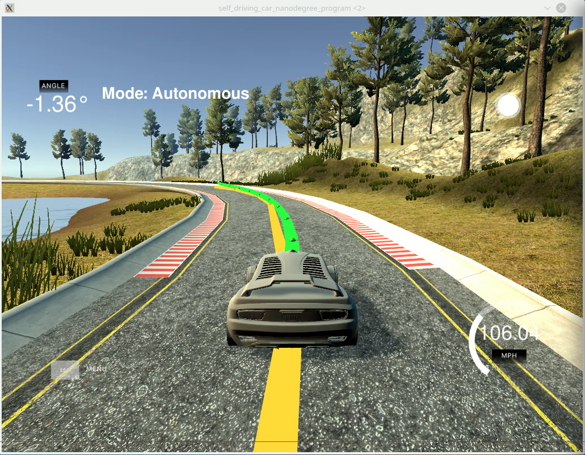

# Model Predictive Controller

## Summary

This project implements a model predictive controller to control velocity and steering angle of a car. It's connected to a simulator and drives a track.

- Given waypoints a target trajectory is calculated as a polynomial.
- Using a kinematic model the update equations for the car's system state are implemented.
- An error function is designed and implemented.
- Using the state update equations the predicted trajectory is calculated to minimize the error function .
- The delay between measurement and update of the control parameters is modelled to improve the control quality
- The car's acceleration behavior with given throttle value is measured and a model is calculated using regression.
- Online calibration is implemented to change the control parameter while driving the car.

## Result




## The model

### State

x, y, psi, v

### Actuators

- Throttle [-1, 1]
- Steering angle [-1, 1]

### Update equations

x(t+dt) = x(t) + v(t) * cos(psi(t)) * dt

y(t+dt) = y(t) + v(t) * sin(psi(t) * dt

psi(t+dt) = psi(t) + v(t) / Lf * delta(t) * dt

v(t+dt) = v(t) + a(t) dt

cte(t+dt) = (f(t) - y(t)) + v(t) * sin(epsi(t) * dt

epsi(t+dt) =(psi(t) - psi_des(t)) - v(t) * delta(t) / Lf * dt

### Number of steps and delta_t

Too many steps -> instability
Not enough steps -> instability
-> 11 steps

Delta_t good about 100ms, choosen as latency (100ms + simulator latency = about 120ms).
Prediction for latency could also be done as separate step.

### Trajectory as polynomials

- coordinate transformation of waypoints from world to vehicle system
- fit polynomial

### Latency

- Timestep = delay
- One timestep with fixed actuator values from last controller output


## Measurement on the simulator units

Measurements were done to check which units are used for the values sent by the simulator.

The result was:

|Value | Unit |
|------|------|
|Speed | mph  |
|x     | m    |
|y     | m    |

Though the units of speed are not m/s using the value directly in the model worked relatively good. But the prediction for the delay was about factor 2 wrong and the predicted trajectory was twice as long as in reality. But since only the first timestep was used the control works even with the wrong unit.

To improve the car's behavior the speed was converted to m/s for the controller.

## Acceleration model

For this project no model to calculate the acceleration from throttle and velocity was given and it was suggested just to use the throttle value between -1 and 1 as acceleration for the system equations.

To have a better prediction measurements were done with different throttle and velocity values and the model parameter for the equation `a = p0_0 * throttle + p0_1 * v + p0_2 * v²` and `throttle = p1_0 * a + p1_1 * v + p1_2 * v²` were calculated in `data_analysis/Vehicle acceleration from throttle and velocity.ipynb`.

For breaking it was measured that every throttle < 0 results in the same deceleration. This behavior couldn't be used in the controller sind it's not differentiable. So a linear model was used between -1 and 0.

## Configuration and online calibration support

With hard coded controller parameter it's very time consuming to try different values. The values have to be changed, a new build has to be done and the simulator has to be started again.

Since a json library was already included this format was choosen also for configuration. The controller parameters can be changed in the file `Config.json`.

To further improve the comfort for checking different parameters an online calibration support was added using a second thread to poll changes in the configuration file and take over new values.

## Encode videos

To reduce the size of the videos to upload on github the video size is reduced.

Encode video for low size:

`ffmpeg -i <input.mp4> -crf 35 <output.mp4>`

---

## Dependencies

* cmake >= 3.5
 * All OSes: [click here for installation instructions](https://cmake.org/install/)
* make >= 4.1(mac, linux), 3.81(Windows)
  * Linux: make is installed by default on most Linux distros
  * Mac: [install Xcode command line tools to get make](https://developer.apple.com/xcode/features/)
  * Windows: [Click here for installation instructions](http://gnuwin32.sourceforge.net/packages/make.htm)
* gcc/g++ >= 5.4
  * Linux: gcc / g++ is installed by default on most Linux distros
  * Mac: same deal as make - [install Xcode command line tools]((https://developer.apple.com/xcode/features/)
  * Windows: recommend using [MinGW](http://www.mingw.org/)
* [uWebSockets](https://github.com/uWebSockets/uWebSockets)
  * Run either `install-mac.sh` or `install-ubuntu.sh`.
  * If you install from source, checkout to commit `e94b6e1`, i.e.
    ```
    git clone https://github.com/uWebSockets/uWebSockets
    cd uWebSockets
    git checkout e94b6e1
    ```
    Some function signatures have changed in v0.14.x. See [this PR](https://github.com/udacity/CarND-MPC-Project/pull/3) for more details.

* **Ipopt and CppAD:** Please refer to [this document](https://github.com/udacity/CarND-MPC-Project/blob/master/install_Ipopt_CppAD.md) for installation instructions.
* [Eigen](http://eigen.tuxfamily.org/index.php?title=Main_Page). This is already part of the repo so you shouldn't have to worry about it.
* Simulator. You can download these from the [releases tab](https://github.com/udacity/self-driving-car-sim/releases).
* Not a dependency but read the [DATA.md](./DATA.md) for a description of the data sent back from the simulator.


## Basic Build Instructions

1. Clone this repo.
2. Make a build directory: `mkdir build && cd build`
3. Compile: `cmake .. && make`
4. Run it: `./mpc`.
